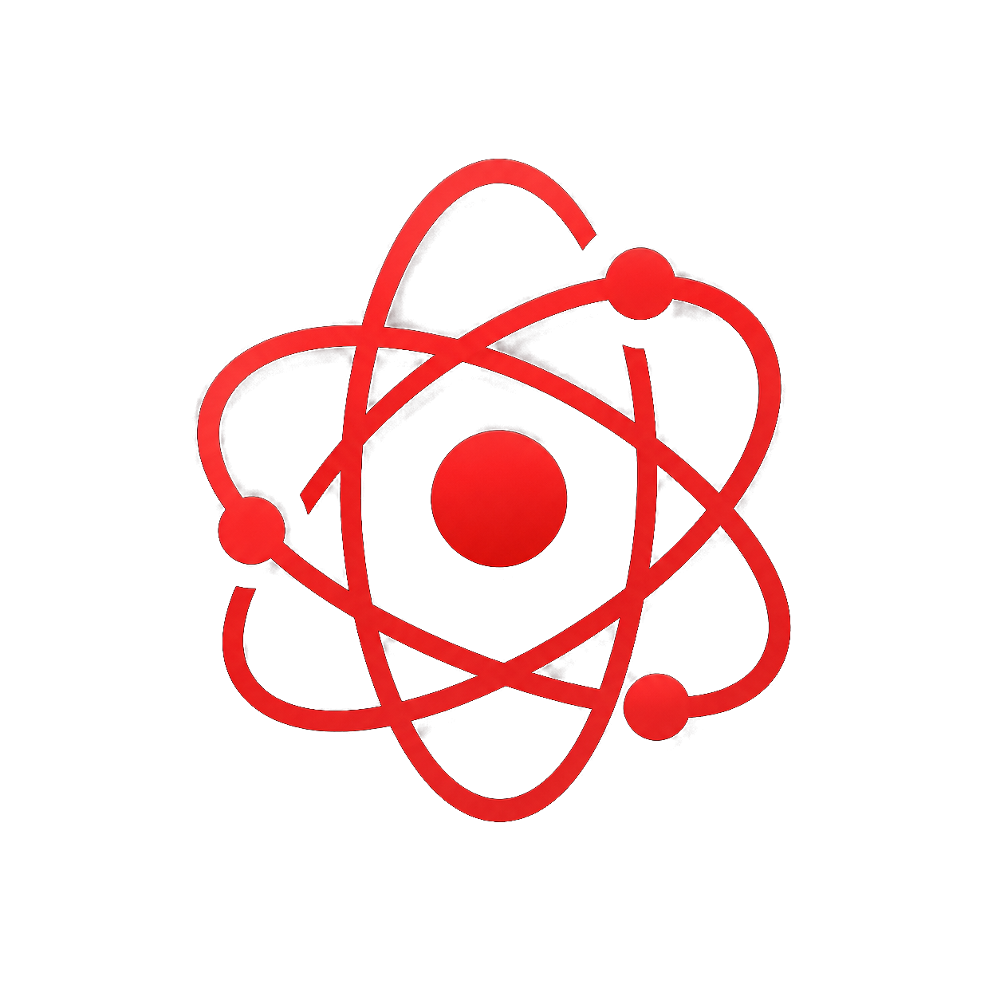

<p align="center">
  <a href="https://tkp12345.github.io/Electronica/">
    
  </a>
</p>

<h1 align="center">Electronica</h1>

<p align="center">
  <a href="https://github.com/tkp12345/Electronica/actions/workflows/deploy.yml">
    
  </a>
  <a href="https://github.com/tkp12345/Electronica/blob/main/LICENSE">
    
  </a>
  <a href="https://tkp12345.github.io/Electronica/">
    
  </a>
  
</p>

<p align="center">
  <strong>Electronica is a community-style, user-built learning guide for <a href="https://www.electronjs.org/">Electron</a>.</strong>
</p>

<p align="center">
  📝 Available languages: 🇺🇸 English · 🇰🇷 한국어 — switch from the navbar on the live site.
</p>

> ℹ️ **What this is**: an independent study notebook written to help newcomers internalize Electron's mental model.
> Where `electronjs.org/docs` is a thorough reference, Electronica is the friendly companion that walks alongside it — every page begins with an original illustration, every code block sits next to a plain-words explanation, and every section closes with a middle-school-friendly recap.
>
> This project is **not affiliated with the OpenJS Foundation or the Electron project**. See the [Trademark notice](#trademark-notice) at the bottom for details.

## Why Electronica?

The official [Electron documentation](https://www.electronjs.org/docs/latest) is excellent, but it's an _English-only reference_ — dense, text-first, and written for people who already speak the language of desktop frameworks. Electronica is built around a different question: **what would these same 42 topics look like if the goal were to make them _easy to learn_?**

That goal shows up in four concrete ways.

### 🇰🇷 A Korean edition the official docs don't have

The biggest gap in the upstream docs is that there's effectively no first-class Korean version. Electronica rewrites all **42 topics in both English _and_ Korean** from scratch — not machine-translated, but re-explained in each language. A navbar toggle switches between `/en/...` and `/ko/...` while **preserving your exact position on the page**, so you can read a concept in one language and instantly compare it in the other.

### 🖼️ A picture before every concept

Every page opens with an **original SVG illustration** in a clean, geometric style with a single red accent — no stock art, no AI noise. Instead of hitting a wall of prose, you see the shape of the idea first (how the main and renderer processes talk, what the sandbox wraps, where code-signing sits in the release flow) and _then_ read the details. The image does the first 10% of the teaching.

### 🤖 Interactions that turn reading into learning

Electronica is meant to be _used_, not just scrolled:

- **A robot helper beside every code block** — an "In plain words" box that paraphrases each snippet in everyday language, so you're never stuck decoding jargon alone.
- **Smooth motion and transitions** that guide your eye through diagrams and steps rather than dumping everything at once.
- **The language toggle** described above, which makes bilingual comparison a single click instead of a separate page hunt.

### 💡 A "plain words" recap on every page

Each page closes with a **쉽게 풀어 설명 / "In plain words"** section — two or three paragraphs at a middle-school reading level that restate the whole topic with no new vocabulary. You leave each page with _comprehension_, not vocabulary fatigue.

> In short: same 42 topics as the official docs, but with a Korean edition, an illustration on every page, friendly interactions, and a plain-language recap — built so that a newcomer can actually learn Electron, not just look things up.

## Tech stack

| Layer | Choice |
| --- | --- |
| Framework | [Next.js 15](https://nextjs.org) (App Router, `output: 'export'`) |
| Docs theme | [Nextra 4](https://nextra.site) (`nextra-theme-docs`) |
| Styling | [Tailwind CSS v4](https://tailwindcss.com/) — utilities only, no preflight |
| Language | TypeScript 5 (strict), React 19 |
| Syntax highlighting | [Shiki](https://shiki.style/) |
| Search | [FlexSearch](https://github.com/nextapps-de/flexsearch), code-aware |
| Hosting | GitHub Pages, project basePath `/Electronica` |

## Repository layout

```text
app/
├── components/              # ElectronIcon, RobotIcon, PageHero, EasyNote, illustrations
├── ko/                      # Korean tree
│   ├── docs/
│   │   ├── introduction/
│   │   ├── why-electron/
│   │   ├── tutorial/        # 6-part tutorial series
│   │   ├── processes/       # main / renderer / sandbox / context-isolation
│   │   ├── best-practices/  # security / performance / offline / accessibility
│   │   ├── examples/
│   │   ├── development/     # debugging / boilerplates / devtools / ... (9 pages)
│   │   ├── native-modules/
│   │   ├── distribution/    # forge / code-signing / mas / snap / store / updates
│   │   ├── testing/         # automated / devtools / profiling / headless
│   │   └── references/      # glossary / versioning / breaking-changes / patches
│   └── _meta.ts
└── en/                      # mirror tree of ko/, content rewritten in English
```

## Adding a page

Every page follows the same MDX skeleton, which keeps the visual rhythm consistent across the site:

```mdx
import { Cards, Callout, Steps, Tabs } from 'nextra/components'
import { PageHero } from '<relative>/components/PageHero'
import { EasyNote } from '<relative>/components/EasyNote'
import { MyIllustration } from '<relative>/components/illustrations'

<PageHero
  illustration={<MyIllustration />}
  title="..."
  subtitle="..."
  badge="..."
/>

<!-- body content; pair each code block with an <EasyNote>...</EasyNote> -->

## In plain words   <!-- or "## 쉽게 풀어 설명" for ko pages -->

<!-- two or three paragraphs at middle-school reading level -->

<Cards>
  <Cards.Card title="Next: ..." href="..." arrow />
</Cards>
```

Then register the page in the nearest `_meta.ts` so it appears in the sidebar in the right order.

## Contributing

Pull requests are warmly welcome — typo fixes, clearer analogies, better illustrations, additional pages.

1. Fork and clone the repository.
2. Edit the relevant `.mdx` under `app/en/...` or `app/ko/...`.
3. If the change is conceptual, please update **both locales** so the EN/KO experience stays in lockstep.
4. Run `npm run typecheck && npm run build` before opening the PR.
5. Open a pull request describing what changed and why.

For larger reorganizations (new sections, renamed slugs, restructured sidebars), please open an issue first so we can talk through the shape.

## Resources

Electronica is a study guide — the upstream sources of truth always live elsewhere:

- 📚 [electronjs.org/docs/latest](https://www.electronjs.org/docs/latest) — the official Electron documentation
- 🧪 [electron/fiddle](https://github.com/electron/fiddle) — run Electron snippets in the browser
- 💬 [Electron Discord](https://discord.gg/electronjs) — the upstream community
- 📰 [Electron blog](https://www.electronjs.org/blog) — release notes and design discussions

## Compatibility notes

- **zod 4.4.x conflicts with Nextra 4** ([nextra#4989](https://github.com/shuding/nextra/issues/4989)). `zod` is pinned to **4.3.x** with `save-exact` until the upstream patch ships.
- **Tailwind v4 preflight is intentionally not imported** so Nextra's default typography keeps working. Use utility classes (`flex`, `gap-4`, etc.) freely; if a component truly needs a reset, scope it locally with its own CSS.

## License

The source code, illustrations, and prose in this repository are released under the [MIT License](LICENSE).

## Trademark notice

The word "Electron" appears in this repository solely to identify the open-source framework that Electronica teaches. The Electron name and the official Electron logo are trademarks of the OpenJS Foundation; when referencing or representing them, please respect the [OpenJS Foundation Trademark Policy](https://trademark-policy.openjsf.org/).

The atom-shaped mark used on this site and inside this README is an **original SVG drawn for Electronica**, not the official Electron logo. It depicts a generic atomic symbol — three intersecting orbital ellipses around a central nucleus — rendered in red as our accent color. Please do not mistake it for, or pass it off as, an OpenJS Foundation asset.

This project is independent and is not affiliated with, sponsored by, or endorsed by the OpenJS Foundation or the Electron project.
